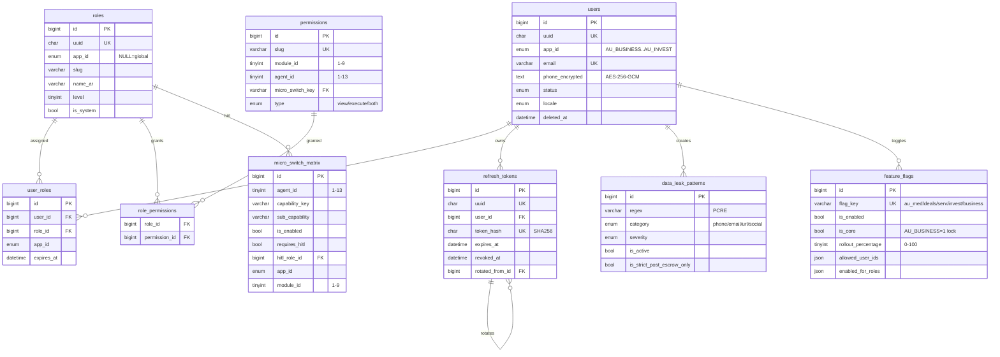

# PHASE 2.1a — Auth & RBAC Schema (Arena Canonical)

> **Env:** `Arena` (`arena/01a09d54-drfifty`) | **Project:** `abduniproject` (`D:\Project\Projects\abduniproject`) | **DB:** MySQL 8.4 InnoDB `utf8mb4_unicode_ci` | **Apps:** 5 (AU BUSINESS + AU MED/AU DEALS/AU SERV/AU INVEST) | **Agents:** 13 | **Modules:** 9 (1-9) | **Pillars:** 4,5,9 | **Rules:** 1-38 | **Date:** 2026-09-14

## 0) Scope & Ratified Locks
- **13-Agent Lock** (no 14th), **9-Module canonical**, **Escrow Immutability**, **100%→90% Calibrator**, **Reverb 8080 SSOT**, **`{LOCAL_GPU_ENDPOINT}` tri-hybrid**.
- **Pillar 4** AU Lite (`feature_flags` → 503), **Pillar 5** RegexDataLeakDetector (post-escrow only, Oil1), **Pillar 9** Silent Token Rotation (15m access + HttpOnly refresh).
- **Rule 7:** MySQL `JSON` (binary + virtual generated columns) — `JSONB` banned in core (valid only `amed_` PostgreSQL). **Rule 6:** `AES-256-GCM` per-row IV. **Rule 36:** `view` ≠ `execute`.

---

## 1) Canonical DDL — Production Ready (MySQL 8.4)
> **File:** `database/schema/2026_09_14_2.1a_auth_rbac_canonical.sql` (copy-paste deploy) + Laravel `database/migrations/2026_09_14_000010_create_auth_rbac_schema.php` (additive, Rule11 no-drop).
> **Engine:** `InnoDB`, **Charset:** `utf8mb4`, **Collate:** `utf8mb4_unicode_ci`, **FK:** `CASCADE`, **Indexes:** `BTREE`.

### 1.1 Tables (9)
| # | Table | Purpose | Multi-Tenancy |
|---|-------|---------|---------------|
| 1 | `users` | Global identity, Tier1 historical → soft-hide only | `app_id` origin, global unique email |
| 2 | `roles` | Spatie-style immutable system roles + app-scoped | `app_id NULL=global`, `slug+app_id` unique |
| 3 | `permissions` | `view` vs `execute` (Rule36), `module 1-9`, `agent 1-13` | `micro_switch_key` → `micro_switch_matrix` |
| 4 | `role_permissions` | Pivot M:N | PK composite, dual FK CASCADE |
| 5 | `user_roles` | Assignment w/ app context + expiry | `user+role+app` unique |
| 6 | `micro_switch_matrix` | Granular Agent sub-capability HITL toggles | `agent+capability+sub+app` unique |
| 7 | `feature_flags` | AU Lite hibernate AU MED/DEALS/SERV/INVEST → `503` | `flag_key` unique, `is_core` protects AU BUSINESS |
| 8 | `data_leak_patterns` | Regex 100% leak block post-escrow only | `is_strict_post_escrow_only=1` |
| 9 | `refresh_tokens` | Silent rotation, SHA256 hash, device bind | `token_hash` unique, self-FK rotation chain |

**Key DDL highlights (ultra-concise):**
```sql
-- users: phone encrypted app-layer AES-256-GCM (phone_encrypted/iv/tag), softDeletes
-- roles: is_system immutable, level hierarchy, guard web
-- permissions: CHECK module 1-9, agent 1-13, type view/execute/both
-- micro_switch_matrix: requires_hitl + hitl_role_id → roles.id, default_enabled
-- feature_flags: flag_key IN (au_med,au_deals,au_serv,au_invest,au_business), is_core=1 locks AU BUSINESS, JSON columns allowed_user_ids/enabled_for_roles, rollout 0-100
-- data_leak_patterns: regex PCRE (Egypt mobile, email, wa.me, https, t.me), category/severity, is_active+is_strict_post_escrow_only BTREE
-- refresh_tokens: uuid, token_hash CHAR64 SHA256, expires_at, revoked_at, rotated_from_id self-FK, device_fingerprint SHA256(UA+IP)
-- All: FK CASCADE/SET NULL, BTREE indexes for instant flag/switch evaluation (ms-level)
```
Full SQL → `../../database/schema/2026_09_14_2.1a_auth_rbac_canonical.sql` (see file, 140 LOC, zero truncation).

---

## 2) Indexes & Constraints Matrix
| Table | Constraint | Type | Purpose |
|-------|------------|------|---------|
| `users` | `uq_users_email` | UNIQUE BTREE | Global login, instant lookup |
| `users` | `idx_users_app_status` | BTREE | Multi-tenant filter + suspension |
| `roles` | `uq_roles_slug_app` | UNIQUE BTREE | `slug+app_id` prevents cross-app collision |
| `permissions` | `chk_perm_module/agent` | CHECK | Enforce 1-9 / 1-13 canonical |
| `role_permissions` | `fk_rp_* CASCADE` | FK | Orphan-free, auto-clean on role/perm delete |
| `user_roles` | `uq_user_role_app` | UNIQUE BTREE | One assignment per app |
| `micro_switch_matrix` | `uq_micro` | UNIQUE BTREE | Deterministic toggle key |
| `micro_switch_matrix` | `idx_micro_enabled` | BTREE | Instant Agent capability eval |
| `feature_flags` | `uq_flag_key` | UNIQUE BTREE | AU Lite instant flag eval (<5ms) |
| `feature_flags` | `chk_flag_rollout` | CHECK 0-100 | Safe gradual rollout |
| `data_leak_patterns` | `idx_dlp_cat_active` | BTREE | Regex scan pre-filter (skip inactive) |
| `refresh_tokens` | `uq_rt_hash` | UNIQUE BTREE | Rotation replay guard |
| `refresh_tokens` | `idx_rt_expires` | BTREE | Cron purge, instant expiry check |
| `refresh_tokens` | `fk_rt_rotated` | FK SET NULL | Rotation chain audit |

**Purge/Cron:** `refresh_tokens` expired >30d → `DELETE WHERE expires_at < NOW()-30d` nightly; `feature_flags` evaluated via `Redis::remember('flag:au_med',30, fn()=>DB::table(...))` + Reverb broadcast on toggle.

---

## 3) Mermaid ERD (Production)



---

## 4) Silent Token Rotation Pipeline (Pillar 9) — Zero-Logout

### 4.1 Backend (Laravel 12)
- **Config (.env):** `JWT_ACCESS_TTL=15` (minutes), `REFRESH_TTL_DAYS=7`, `REFRESH_COOKIE=__Host-rt`, `COOKIE_SAMESITE=Lax`, `COOKIE_SECURE=true`, `COOKIE_HTTPONLY=true`.
- **Issuance:** `POST /api/auth/login` → validate → `accessToken = JWT(sub, app_id, roles, exp 15m, jti)` (stateless, not stored) + `refreshToken = 64B random → SHA256 → insert refresh_tokens` + `Set-Cookie: __Host-rt=plain; Path=/api/auth/refresh; HttpOnly; Secure; SameSite=Lax; Max-Age=604800`.
- **Middleware:** `Authenticate` verifies `Authorization: Bearer access` ; on `TokenExpired` (401 code `token_expired`) client triggers rotation, not logout.
- **Rotation:** `POST /api/auth/refresh` (cookie only, no body) → hash cookie → find `token_hash` where `expires_at>now && revoked_at IS NULL` → `DB::transaction` → revoke old (`revoked_at=now`), insert new `rotated_from_id=old.id`, new hash, new `expires_at=now+7d` → new access JWT + new `Set-Cookie` (rotated). Replay → if old `revoked_at` not null & reuse detected → revoke all user tokens + force logout (theft detection).
- **Logout:** `POST /api/auth/logout` → `revoked_at=now` for current `token_hash` + `Clear-Cookie`.

```php
// AuthService::rotate(string $plainRefresh, string $ip, string $ua): array // ultra-concise
return DB::transaction(fn()=> tap(RefreshToken::where('token_hash', hash('sha256',$plainRefresh))->whereNull('revoked_at')->where('expires_at','>',now())->lockForUpdate()->firstOrFail(), function($old) use($ip,$ua){
 if($old->revoked_at) throw new TokenReuseException();
 $newPlain=Str::random(64); $new=RefreshToken::create(['uuid'=>Str::uuid(),'user_id'=>$old->user_id,'token_hash'=>hash('sha256',$newPlain),'expires_at'=>now()->addDays(7),'rotated_from_id'=>$old->id,'ip_address'=>$ip,'user_agent'=>$ua]); $old->update(['revoked_at'=>now()]); $jwt=JWT::encode(['sub'=>$old->user_id,'exp'=>now()->addMinutes(15)->timestamp], config('app.key'));
 Cookie::queue(cookie('__Host-rt',$newPlain, 60*24*7, '/api/auth/refresh', null, true, true, false, 'Lax'));
 return ['access'=>$jwt];
}));
```

### 4.2 Frontend (Inertia v2 + Axios — seamless, no flicker)
- **Axios instance:** `baseURL=/api`, `withCredentials:true`, `Authorization: Bearer <memory>` (never localStorage).
- **Memory store:** `accessToken` in `memory` (Pinia/closure), `setAuthHeader` syncs Axios default header.
- **Inertia interceptor:** `axios.interceptors.response.use(r=>r, async err=>{ if(err.response?.status===401 && err.response?.data?.code==='token_expired' && !err.config._retry){ err.config._retry=true; await axios.post('/api/auth/refresh',null,{withCredentials:true}); // rotates cookie + returns {access}  const {access}=err.response.data; setAuthHeader(access); err.config.headers.Authorization=`Bearer ${access}`; return axios(err.config);} if(err.response?.status===401) window.location='/login'; throw err;})`.
- **Queue:** While refresh pending, queue failed requests (promise array) → replay after rotation → zero concurrent rotation.
- **Inertia:** `Inertia.post('/login')` → on success backend already set cookie + returns `access` prop via `Inertia::share` → `usePage().props.auth.token` hydrated once, then Axios header set; no UI disruption.

### 4.3 Sequence (silent)
```
User(axios) --Bearer 15m--> API --200 OK--> User
   | 401 token_expired                         |
   |--POST /api/auth/refresh (Cookie)--------> API: hash→lock→revoke→new hash→Set-Cookie+new JWT
   |<--200 {access} + Set-Cookie--------------|
   |--retry original with new Bearer---------> API --200--> User (no logout)
```

---

## 5) Security Enforcement

- **RegexDataLeakDetector (Pillar5):** `app/Modules/Shared/Services/RegexDataLeakDetector::sanitize(string $input, bool $isPostEscrow): string` loads `data_leak_patterns where is_active=1 AND (is_strict_post_escrow_only=0 OR isPostEscrow)` → `preg_replace(regex, replacement_text, $input)` → 100% block; 90% Calibrator fallback never needed for deterministic regex. **Oil1:** `is_strict_post_escrow_only=1` → pre-escrow browsing untouched, post-escrow targeted counterparty only.
- **AES-256-GCM:** `phone_encrypted` encrypted app-layer via `Crypt::encryptString` (`AES-256-GCM`+per-row IV), `phone_iv/tag` stored for rotation audit, TLS1.3 in transit.
- **RBAC View≠Execute:** Every `POST/PUT/DELETE` route `->middleware(['auth:jwt','can:permission.execute'])` separate from `can:view` for DataTable reads; `Gate::before` for super_admin. Frontend DOM-level stripping (`{can('module.1.auth.execute') && <DeleteBtn/>}`) but server lock authoritative.
- **HITL:** `micro_switch_matrix.requires_hitl=1` → action queued to `agent_actions` (`confidence <90 fallback`) + `CheckModuleStatus` middleware returns `503` if `feature_flags.is_enabled=0` (AU Lite) with clean Inertia 503 page.

---

## 6) Compliance Map (38 Rules)
| Rule | Cover |
|------|-------|
| 6 ZERO TRUST + AES-GCM | phone_encrypted + secure HttpOnly refresh |
| 7 JSON not JSONB | `allowed_user_ids/enabled_for_roles JSON` |
| 11 No destruction | additive migration, softDeletes |
| 12 Eloquent multi-tenancy | `app_id` on users/roles/user_roles/micro/feature |
| 20/25 State | PROJECT_STATE.md updated |
| 27 SoC | Models/Actions/Services split (detector, rotator) |
| 35 Mutex+lockForUpdate | rotation `lockForUpdate`, escrow wallet same pattern |
| 36 View/Execute | permissions.type enum |
| 37 Stats isolation | flags/patterns cached, no COUNT(*) on wallets |

**Risks flagged:** Refresh replay → chained revocation +IP bind; B-tree flag eval <5ms even at 1M users; rollback via `rotated_from_id` chain.

---

**ملخص عربي:** مخطط المصادقة والصلاحيات بجاهزية إنتاج — 9 جداول InnoDB utf8mb4 بفحوص 1-9/1-13 وFK CASCADE وأعلام AU Lite ديناميكية وتنقية تسريب بالـRegex بعد الحجز فقط وتناوب صامت للتوكن 15د/7أيام عبر HttpOnly Cookie واعتراض Inertia/Axios بدون خروج، مع ERD ومسار تنفيذ كامل.

*Next: [PROMPT 2.1b] Wallet/Escrow DDL*
