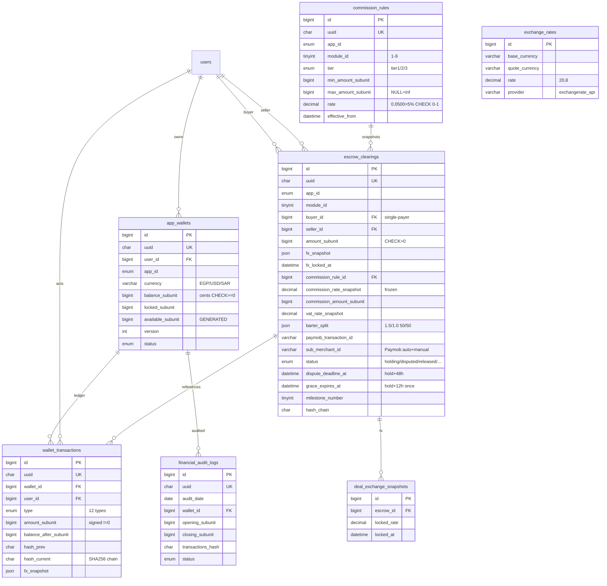

# PHASE 2.1b — Wallet & Escrow Engine Schema (Arena Canonical)

> **Env:** `Arena` (`arena/01a09d54-drfifty`) | **Project:** `abduniproject` | **DB:** MySQL 8.4 InnoDB `utf8mb4_unicode_ci` | **Apps:** 5 | **Modules:** 9 (1-9) | **Pillars:** 6,1 | **Rules:** 1-38 | **Date:** 2026-09-14

## 0) Ratified Locks Enforced
- **Ledger Q8-14:** Unified multi-currency **no base**, subunit `BIGINT` (cents/piasters), FX `locked_at` settlement, double-entry hash append-only, daily reconciliation, `CHECK balance>=0`.
- **Escrow Q15-27 + Oil3/4/6:** Closed/Blind **Paymob** (no local liquidity), **single-payer buyer only** (Oil3), **48h dispute** → `dispute_deadline_at=hold+48h`, **12h grace once** → `grace_expires_at=hold+12h` → `expired_grace` + waiting-list reroute + technical penalty (Oil4), **partial milestone** (`milestone_number/total`), **0 wallet penalties**, **24h hold**, **dynamic VAT**, **chargeback freeze**, **rolling caps**, **90d vault hot → S3 Parquet**, **no code buyout SaaS-only** (Oil6).
- **Wallet Q34-39 + Oil2:** **5% unified base** `0.0500` at launch, **per-module dynamic** via `commission_rules` dashboard, **OCR $0.01 exact → manual**, **barter 1.5x/1.0 split 50/50** (`barter_split JSON`), **sacred wallet** (no negative via CHECK+TRIGGER).
- **FX Seed:** `provider=exchangerate_api` Cron `*/30`, transparent `locked_rate`.

---

## 1) Canonical DDL — Production Ready
> **File:** `database/schema/2026_09_14_2.1b_wallet_escrow_canonical.sql` (copy-paste) + Laravel `database/migrations/2026_09_14_000011_create_wallet_escrow_schema.php` (additive, Rule11).

| # | Table | Purpose | Key Design |
|---|-------|---------|------------|
| 1 | `app_wallets` | Unified multi-currency wallet per `user+app+currency` | `balance_subunit` + `locked_subunit` + `available_subunit GENERATED STORED`, `CHECK >=0`, `version` |
| 2 | `exchange_rates` | Central FX (`exchangerate_api` */30) | `uq_fx_pair`, `rate DECIMAL(20,8)` |
| 3 | `commission_rules` | **3-Tier Engine** per `app+module` | `tier1/2/3` + `min/max_subunit` + `rate 0-1` + `effective_from/to` versioning |
| 4 | `escrow_clearings` | **Escrow Immutability** — snapshots frozen at creation | `amount_subunit`, `commission_rate_snapshot`, `fx_snapshot/locked_at`, `barter_split`, `paymob_transaction_id/sub_merchant_id`, `dispute+48h`, `grace+12h` |
| 5 | `deal_exchange_snapshots` | FX frozen per escrow/deal | `locked_rate/locked_at` |
| 6 | `wallet_transactions` | **Append-only hash chain ledger** | `amount_subunit signed`, `balance_after`, `hash_prev/current SHA256`, `TRIGGER no UPDATE/DELETE` |
| 7 | `financial_audit_logs` | Daily reconciliation + 90d hot → S3 | `audit_date+wallet` unique, `transactions_hash` chain |

**Highlights (ultra-concise):**
```sql
-- app_wallets: UNIQUE(user,app,currency), CHECK balance>=0 AND balance>=locked, version for lock
-- commission_rules: UNIQUE(app,module,tier,effective_from), CHECK module 1-9, rate 0-1, range min<max
-- escrow_clearings: CHECK module 1-9, amount>0, status holding→...→waiting_list, FK buyer/seller RESTRICT, snapshots frozen via TRIGGER
-- wallet_transactions: CHECK amount<>0, hash chain, JSON fx_snapshot/meta, BTREE wallet+created, immutable TRIGGER
```

---

## 2) Indexes & Constraints Matrix
| Table | Constraint | Type | Purpose |
|-------|------------|------|---------|
| `app_wallets` | `chk_w_bal_ge0` `chk_w_avail_ge0` | CHECK | Sacred wallet — never negative |
| `app_wallets` | `uq_wallet_user_app_cur` | UNIQUE BTREE | One wallet per currency/app |
| `app_wallets` | `available_subunit` | GENERATED STORED | Instant available calc, no app math drift |
| `commission_rules` | `chk_rule_rate 0-1` | CHECK | Safe 5% base, per-module dashboard |
| `commission_rules` | `uq_rule_tier_active` | UNIQUE BTREE | Versioned tier, instant lookup |
| `escrow_clearings` | `trg_esc_no_snapshot_update` | TRIGGER | **Immutability**: snapshot fields frozen |
| `escrow_clearings` | `idx_esc_status` `idx_esc_paymob` | BTREE | Dispute/grace cron + Paymob webhook |
| `wallet_transactions` | `trg_wt_no_update/delete` | TRIGGER | Ledger append-only |
| `wallet_transactions` | `idx_wt_wallet` | BTREE | Per-wallet statement <50ms |
| `financial_audit_logs` | `uq_audit_day_wallet` | UNIQUE BTREE | Daily reconciliation idempotent |

---

## 3) Mermaid ERD



---

## 4) Escrow Immutability Constraint (Dynamic Rates Apply ONLY to New)
- **Snapshot at creation:** On `escrow_clearings` INSERT, service resolves `commission_rules` (`app_id+module_id` + amount tier + `effective_from <= now < effective_to` + `is_active`) → `rate` → `commission_rate_snapshot` frozen, `commission_amount_subunit = amount * rate`, `fx_snapshot = {rates, locked_at}` from `exchange_rates`/`deal_exchange_snapshots`, `vat_rate_snapshot` frozen.
- **Guard:** `BEFORE UPDATE TRIGGER` rejects any change to `commission_rate_snapshot`, `amount_subunit`, `fx_snapshot`. Dashboard changes to `commission_rules` (e.g., 5%→6% for `AU DEALS`) affect **only** new `escrow_clearings` (new `effective_from` row), old rows retain frozen snapshot → auditable, deterministic settlement.
- **Hash chain:** `hash_chain = SHA256(prev_hash + uuid + amount + currency + buyer + seller)` append-only, verified nightly by `financial_audit_logs`.

## 5) 3-Tier Commission Engine (Oil2)
```
Tier1 Micro: 0 – 50k EGP (0–5,000,000 subunit) → rate 5.00% (default)
Tier2 Growth: 50k – 500k → rate 5.00% (dashboard adjustable per module)
Tier3 Enterprise: 500k+ → rate 5.00% (adjustable)
```
- **Unified base 5%** at launch, **per-module dynamic** via Admin Dashboard (`app_id+module_id` row + `effective_from` versioning, `effective_to` for sunset).
- **Resolution:** `SELECT rate FROM commission_rules WHERE app_id=? AND module_id=? AND ? BETWEEN min AND max AND is_active=1 AND effective_from<=NOW() ORDER BY effective_from DESC LIMIT 1`.
- **Seeds:** `AU_BUSINESS:1` and `AU_DEALS:4` pre-seeded tier1-3 5% (see SQL), extensible to `AU MED/SERV/INVEST` via dashboard without migration.

## 6) Dynamic Wallet Race-Condition Protection (Pillar 6)
**Stack:** `DB Pessimistic Lock (SELECT ... FOR UPDATE)` + `Redis Mutex (SET NX PX)` — deterministic, zero double-spend under parallel burst.

```php
// WalletService::transfer() — ultra-concise — Arena clean
use Illuminate\Support\Facades\DB; use Illuminate\Support\Facades\Cache;
$mutexKey="wallet:lock:{$wallet->id}";
$lock=Cache::lock($mutexKey, 10); // Redis NX 10s (Predis/Redis)
if(!$lock->get()) throw new WalletBusyException();
try {
  DB::transaction(function() use($walletId, $delta, $type, $ref){
    $w=DB::table('app_wallets')->where('id',$walletId)->lockForUpdate()->first(); // Pessimistic
    if($w->balance_subunit + $delta < 0 || $w->balance_subunit - $w->locked_subunit + $delta <0) throw new InsufficientFunds();
    $prev=DB::table('wallet_transactions')->where('wallet_id',$walletId)->orderByDesc('id')->value('hash_current');
    $newBal=$w->balance_subunit + $delta; $uuid=Str::uuid(); $hash=hash('sha256', ($prev??'GENESIS').$uuid.$delta.$newBal);
    DB::table('wallet_transactions')->insert(['uuid'=>$uuid,'wallet_id'=>$walletId,'user_id'=>$w->user_id,'app_id'=>$w->app_id,'type'=>$type,'amount_subunit'=>$delta,'balance_after_subunit'=>$newBal,'currency'=>$w->currency,'reference_uuid'=>$ref,'hash_prev'=>$prev,'hash_current'=>$hash,'created_at'=>now()]);
    DB::table('app_wallets')->where('id',$walletId)->update(['balance_subunit'=>$newBal,'version'=>$w->version+1,'updated_at'=>now()]);
  });
} finally { $lock->release(); }
```
- **Velocity:** `Redis Throttle 5/min` per wallet (Q24) + `version` increment detects stale lock.
- **Tests:** Parallel 100 req → single winner, 99 `WalletBusy`/`retry 50ms`, balance invariant `CHECK` hard-guard.

## 7) Financial Audit & Vault
- **Daily:** Cron `00:05` aggregates `wallet_transactions` per `wallet_id` → `financial_audit_logs` (`opening/closing`, `debits/credits`, `transactions_hash=SHA256(chain)`). `status pending → reconciled` via `prev_hash` chain. Mismatch → `Calibrator` alert + `Fail2ban` freeze.
- **90d hot → S3 Parquet + hash archive** (suggestion): `AUDIT_HOT_DAYS=90`, cold to `s3://vault-audit/YYYY-MM-DD.parquet` with `SHA256` manifest, `Bar` search via `prev_hash`.
- **Stats isolation (Rule37):** Dashboards read `financial_audit_logs` only, never `COUNT(*)` on `wallet_transactions`/`escrow_clearings`.

## 8) Paymob Blind Sub-Merchant Flow (Closed Escrow)
`buyer → Paymob capture (paymob_transaction_id) → escrow_clearings holding (locked_subunit += amount) → 48h dispute window → release: commission/vat split → seller payout via sub_merchant_id (Paymob Transfer API auto; manual queue fallback) → wallet_transactions paymob_capture + escrow_release`. Sub-merchant auto-created via `Paymob API /api/ecommerce/sub-merchants` on seller KYC pass, else queued `manual_sub_merchant_queue`.

---

## 9) Compliance Map
| Rule | Cover |
|------|-------|
| 6 ZERO TRUST | `CHECK balance>=0`, TRIGGER immutability, hash chain |
| 7 JSON | `fx_snapshot/barter_split/meta JSON` |
| 11 Additive | `Schema::hasTable` + `hasColumn` upgrade |
| 12 Multi-tenancy | `app_id` all tables + `user+app+currency` unique |
| 27 SoC | Models/Actions/Services split (`WalletService`, `EscrowService`) |
| 35 Mutex+lockForUpdate | Code §6 |
| 37 Stats isolation | `financial_audit_logs` |
| Oil2/3/4 | 5% snapshot, single-payer, 12h grace |

**Risks flagged:** FX drift → `locked_at` freezes; concurrent burst → Redis+FOR UPDATE guarantees serializable; snapshot drift → TRIGGER hard-blocks.

---

**ملخص عربي:** محرك مالي ومقبوضات بجاهزية إنتاج — محافظ موحدة متعددة العملات بفحص عدم السالب وهاش متسلسل غير قابل للتعديل، مع تجميد عمولة 5% وسعر صرف عند إنشاء الضمان فقط، وحماية تزامن صارمة (حبس تشاؤمي + Redis) تمنع الإنفاق المزدوج، وتدقيق يومي وهاش للأرشفة.

*Next: [PROMPT 2.1c] Listings & Taxonomy*
