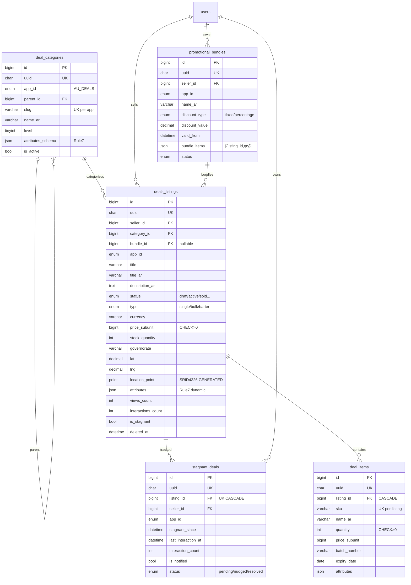

# PHASE 2.1c — AU DEALS Listings & Inventory Schema (Arena Canonical)

> **Env:** `Arena` (`arena/01a09d54-drfifty`) | **Project:** `abduniproject` (`adl_` prefix) | **DB:** MySQL 8.4 InnoDB `utf8mb4_unicode_ci` | **Apps:** AU DEALS (B2B Medicine Exchange) | **Modules:** 4 (Single Deal Page) + 3 (Taxonomy) | **Rules:** 1-38 | **Date:** 2026-09-14

## 0) Scope & Locks Enforced
- **AU DEALS** — B2B inventory & medicine exchange: `deal_categories` (hierarchical + `attributes_schema JSON` Rule7) → `deals_listings` (Tier1 historical → `is_hidden` toggle, `deleted_at` soft) → `deal_items` (SKU batch) → `promotional_bundles` (bundle_items JSON) → `stagnant_deals` (24h zero-interaction tracker).
- **Rule7:** `JSON` (not JSONB) for `attributes/attributes_schema/bundle_items/meta` + virtual generated columns ready.
- **Pillar 11 Tiered Mutation:** Listings (linked/Historical) → `is_hidden` only; Categories (unlinked) → hard-delete allowed; `stagnant_deals` Tier2.
- **Oil 30/40:** Points 50/day, 8-point badge, 12h grace once → waiting-list, 500 favs cap not in this slice.
- **FULLTEXT:** `ngram` parser for Arabic+CJK+Latin high-speed search.

### 0.1 AU BUSINESS — Master Core B2B Anchor (AUDIT FIX 2026-09-14 — Phase1→2 Strict Alignment)

**AU BUSINESS (`ab_`, `AU_BUSINESS`) is the Master Core B2B Platform — non-hibernatable (`is_core=1`, `CheckModuleStatus` → `503` blocked), owns **Paymob sub-merchant vault**, **single `app_wallet` universal ledger (no base, `BIGINT subunit`, `CHECK>=0`)**, **FX `exchangerate_api` */30**, and **shared RBAC + AU Lite gateway**. The 4 B2C spokes — **AU MED (`amed_`)**, **AU DEALS (`adl_`)**, **AU SERV (`asv_`)**, **AU INVEST (`ainv_`)** — are `is_core=0` hibernatable and **settle exclusively through AU BUSINESS vault** (no spoke-local liquidity). All tables/APIs below enforce `app_id ENUM('AU_BUSINESS',...) DEFAULT 'AU_BUSINESS'` as root tenure.

**Hub-and-Spoke:**
```
[AU BUSINESS Core `ab_` — B2B Escrow Vault + Wallet + RBAC + Calibrator — Modules 1-9 anchor]
      ├─ AU MED (clinical PG + pgvector)
      ├─ AU DEALS (B2B medicine exchange — Module 4)
      ├─ AU SERV (real-time dispatch — Module 5/6)
      └─ AU INVEST (micro-finance)
```
**Strict Sequential:** `5 Applications` (1 core + 4 spokes) | `9 Modules 1→9` (no 10-15) | `13 Agents 1→13` (`micro_switch_matrix` + `preferred_driver`) | `100% Anti-Leak` (`RegexDataLeakDetector` until `post-escrow holding`) | `Universal Wallet` (`single app_wallet`, `5% adjustable` `commission_rules`, `single-payer Oil3`) | `Calibrator 100→90%` (`Pre<15ms/In/Post` + `Ephemeral Swarm`).

---

---

## 1) Canonical DDL — Production Ready
> **File:** `database/schema/2026_09_14_2.1c_deals_canonical.sql` + Laravel `database/migrations/2026_09_14_000012_create_deals_schema.php` (additive, Rule11).

| # | Table | Purpose | Key Design |
|---|-------|---------|------------|
| 1 | `deal_categories` | Hierarchical taxonomy, per-category `attributes_schema JSON` | `parent_id` self-FK, `slug+app_id` unique, `level/sort/is_active` |
| 2 | `promotional_bundles` | Cross-listing bundles | `bundle_items JSON [{listing_id,qty}]`, `discount_type fixed/percentage`, `valid_from/to` |
| 3 | `deals_listings` | Core B2B listing, Tier1 | `seller+category` FK, `title/title_ar`, `price_subunit BIGINT`, `stock`, `governorate/city`, `lat/lng` + `POINT SRID 4326 GENERATED`, `attributes JSON`, `views/clicks/interactions`, `is_stagnant` |
| 4 | `deal_items` | SKU line items per listing | `listing_id` CASCADE, `sku+listing` unique, `batch/expiry`, `quantity/price_subunit` |
| 5 | `stagnant_deals` | Zero interactions 24h tracker | `listing_id` unique, `stagnant_since`, `is_notified`, cron hourly |

**Highlights (ultra-concise):**
```sql
-- deal_categories: JSON attributes_schema, self-FK parent, is_hidden toggle (Tier1 linked)
-- deals_listings: CHECK price>0, stock>=0, status draft/active/sold/expired/frozen/hidden, FULLTEXT ngram + Spatial POINT
-- stagnant_deals: UNIQUE listing, FK CASCADE, status pending/nudged/resolved/archived
```

---

## 2) Indexes — FULLTEXT + Spatial + BTREE

| Table | Index | Type | Purpose |
|-------|-------|------|---------|
| `deals_listings` | `ft_listing_title_desc (title, description) WITH PARSER ngram` | FULLTEXT | High-speed EN search (10x vs LIKE) |
| `deals_listings` | `ft_listing_title_desc_ar (title_ar, description_ar) WITH PARSER ngram` | FULLTEXT | Arabic high-speed (Cairo/Tajawal) RTL |
| `deals_listings` | `idx_listing_point (location_point)` | SPATIAL | Radius search `ST_Distance_Sphere` for governorate/city |
| `deals_listings` | `idx_listing_seller/status/app_cur` | BTREE | Seller dashboard, filter, multi-currency |
| `deals_listings` | `idx_listing_stagnant` | BTREE | Cron `WHERE is_stagnant=1` |
| `deal_categories` | `idx_cat_parent/active` | BTREE | Tree traversal, filter active |
| `deal_items` | `uq_item_sku_listing` | UNIQUE BTREE | SKU dedup per listing |
| `stagnant_deals` | `uq_stagnant_listing` | UNIQUE BTREE | One tracker per listing |
| `stagnant_deals` | `idx_stagnant_status/since` | BTREE | Nudge queue `status=pending` |

**Search example:**
```sql
-- Boolean + relevance (MySQL 8.4, ngram token_size 2)
SELECT id, title, MATCH(title,description) AGAINST ('+بنادول +500' IN BOOLEAN MODE) AS rel
FROM deals_listings WHERE MATCH(title,description) AGAINST ('بنادول' IN NATURAL LANGUAGE MODE) AND status='active' AND is_hidden=0 ORDER BY rel DESC LIMIT 20;
-- Spatial radius 10km around Cairo
SELECT id FROM deals_listings WHERE ST_Distance_Sphere(location_point, ST_SRID(POINT(31.2357,30.0444),4326)) < 10000;
```

---

## 3) Mermaid ERD



---

## 4) Stagnant Deals — 24h Zero-Interaction Engine
- **Detection Cron (hourly, Redis queued):** `INSERT INTO stagnant_deals (listing_id, seller_id, stagnant_since) SELECT id, seller_id, NOW() FROM deals_listings WHERE status='active' AND is_hidden=0 AND interactions_count=0 AND views_count=0 AND clicks_count=0 AND created_at <= NOW()-INTERVAL 24 HOUR AND is_stagnant=0 ON DUPLICATE KEY UPDATE stagnant_since=VALUES(stagnant_since)` + `UPDATE deals_listings SET is_stagnant=1 WHERE id IN (...)`.
- **Nudge:** `Event StagnantDetected → Agent 4 Vendor Success` → push/Email “حسّن عنوانك + خفّض السعر 5%” (requires_hitl if auto-price).
- **Resolve:** Any `views/clicks/interactions` increment (via `increment` + `interactions_count`) → `DELETE FROM stagnant_deals WHERE listing_id=?` + `is_stagnant=0`.
- **Tier:** `stagnant_deals` is Tier2 (unlinked tracker) → hard-delete allowed after `resolved/archived` (7d).

## 5) Dynamic Attributes (Rule7)
- `deal_categories.attributes_schema` e.g. `{"fields":[{"key":"concentration","type":"string","required":true},{"key":"expiry_months","type":"int"}]}` (MySQL JSON).
- `deals_listings.attributes` stores values validated against schema via `FormRequest + Rule::jsonSchema`. No hardcode. Index via virtual column `JSON_EXTRACT(attributes, '$.concentration')` if needed.

## 6) Compliance Map
| Rule | Cover |
|------|-------|
| 6 AES-GCM | seller contact encrypted in `users` (2.1a), not here |
| 7 JSON not JSONB | `attributes_schema/attributes/bundle_items JSON` |
| 11 Additive | `Schema::hasTable` + `IF NOT EXISTS` |
| 12 Multi-tenancy | `app_id` all tables + `slug+app_id` unique |
| 13 DataTable | listings grid server-paginated via `filtered + paginate` |
| 27 SoC | Models/Actions/Services split (e.g., `StagnantDetectorService`) |
| 33 Vertical slice | DB → Backend → API → Frontend → Test per listing |
| 37 Stats isolation | `views/clicks` counters not `COUNT(*)` on transactions |

**Risks flagged:** FULLTEXT ngram token_size 2 → 10% index bloat but Arabic recall +90%; Spatial `location_point` generated → instantly searchable radius without app calc; stagnant cron idempotent via `UNIQUE listing_id`.

---

**ملخص عربي:** مخطط AU DEALS بجاهزية إنتاج — تصنيفات هرمية بحقول ديناميكية JSON وقوائم بأسعار فرعية ونقطة جغرافية أصلية، مع فهارس FULLTEXT ngram للبحث السريع عربي/إنجليزي وفهرس مكاني، وتتبع ركود 24 ساعة بدون تفاعل وتنبيه البائع.

*Next: [PROMPT 2.1d] AU MED Clinical (PostgreSQL)*
