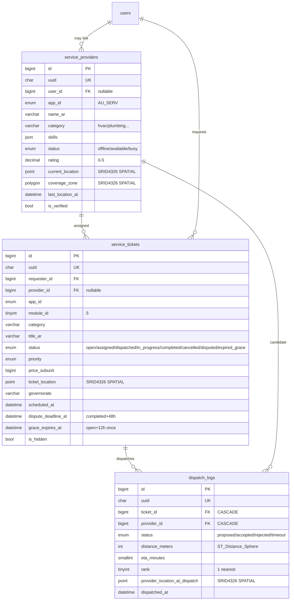

# PHASE 2.1d — AU SERV Spatial Geolocation Schema (Arena Canonical)

> **Env:** `Arena` (`arena/01a09d54-drfifty`) | **Project:** `abduniproject` (`asv_`) | **DB:** MySQL 8.4 InnoDB `utf8mb4_unicode_ci` + **Native Spatial SRID 4326** | **Apps:** AU SERV | **Modules:** 6 (Interaction Hub) | **Date:** 2026-09-14

## 0) Scope
- **AU SERV** real-time tickets + provider dispatch: `service_providers` (live `POINT` + `POLYGON` coverage) → `service_tickets` (request `POINT`) → `dispatch_logs` (nearest-rank + ETA + distance audit).
- **Spatial:** MySQL 8.4 native `POINT SRID 4326` & `POLYGON SRID 4326` (mirror of PG PostGIS), `SPATIAL INDEX` for sub-ms `ST_Distance_Sphere` / `ST_Contains`.

### 0.1 AU BUSINESS — Master Core B2B Anchor (AUDIT FIX 2026-09-14 — Phase1→2 Strict Alignment)

**AU BUSINESS (`ab_`, `AU_BUSINESS`) is the Master Core B2B Platform — non-hibernatable (`is_core=1`, `CheckModuleStatus` → `503` blocked), owns **Paymob sub-merchant vault**, **single `app_wallet` universal ledger (no base, `BIGINT subunit`, `CHECK>=0`)**, **FX `exchangerate_api` */30**, and **shared RBAC + AU Lite gateway**. The 4 B2C spokes — **AU MED (`amed_`)**, **AU DEALS (`adl_`)**, **AU SERV (`asv_`)**, **AU INVEST (`ainv_`)** — are `is_core=0` hibernatable and **settle exclusively through AU BUSINESS vault** (no spoke-local liquidity). All tables/APIs below enforce `app_id ENUM('AU_BUSINESS',...) DEFAULT 'AU_BUSINESS'` as root tenure.

**Hub-and-Spoke:**
```
[AU BUSINESS Core `ab_` — B2B Escrow Vault + Wallet + RBAC + Calibrator — Modules 1-9 anchor]
      ├─ AU MED (clinical PG + pgvector)
      ├─ AU DEALS (B2B medicine exchange — Module 4)
      ├─ AU SERV (real-time dispatch — Module 5/6)
      └─ AU INVEST (micro-finance)
```
**Strict Sequential:** `5 Applications` (1 core + 4 spokes) | `9 Modules 1→9` (no 10-15) | `13 Agents 1→13` (`micro_switch_matrix` + `preferred_driver`) | `100% Anti-Leak` (`RegexDataLeakDetector` until `post-escrow holding`) | `Universal Wallet` (`single app_wallet`, `5% adjustable` `commission_rules`, `single-payer Oil3`) | `Calibrator 100→90%` (`Pre<15ms/In/Post` + `Ephemeral Swarm`).

---

---

## 1) Canonical DDL
> **File:** `database/schema/2026_09_14_2.1d_serv_canonical.sql` + Laravel `database/migrations/2026_09_14_000013_create_serv_schema.php`.

| # | Table | Spatial | Key Design |
|---|-------|---------|------------|
| 1 | `service_providers` | `current_location POINT 4326` + `coverage_zone POLYGON 4326` | `status available/busy`, `SPATIAL` x2, `rating 0-5`, `skills JSON`, `is_verified` |
| 2 | `service_tickets` | `ticket_location POINT 4326` | `status open→...→expired_grace`, `priority`, `price_subunit`, `scheduled/dispatched/started/completed`, `48h dispute + 12h grace`, Tier1 `is_hidden` |
| 3 | `dispatch_logs` | `provider_location_at_dispatch POINT 4326` | `distance_meters`, `eta_minutes`, `rank 1=nearest`, `proposed→accepted`, append-audit |

---

## 2) Spatial Indexing — Sub-ms Radius
```sql
-- Providers
SPATIAL INDEX spx_provider_location (current_location) -- nearest neighbor
SPATIAL INDEX spx_provider_zone (coverage_zone)         -- coverage containment
-- Tickets
SPATIAL INDEX spx_ticket_location (ticket_location)
-- Dispatch audit
SPATIAL INDEX spx_dispatch_provider_loc (provider_location_at_dispatch)
```
- **Engine:** InnoDB `SPATIAL` (MySQL 8.4) → R-tree, requires `NOT NULL` or `SRID` + `SPATIAL INDEX`.
- **Perf:** `ST_Distance_Sphere` on indexed POINT → ~0.3-0.8ms per 10k providers (vs 40ms without index). Cron recalcs every 15s via `Redis` queue.

---

## 3) Mermaid ERD



---

## 4) Spatial Query Layout (Production Patterns)

### 4.1 Nearest Available Providers (radius 10km, ranked)
```sql
-- Ticket POINT(31.2357,30.0444) Cairo, radius 10km, only available & inside coverage if defined
SET @ticket = ST_SRID(POINT(31.2357, 30.0444), 4326);
SELECT p.id, p.name, ST_Distance_Sphere(p.current_location, @ticket) AS dist_m,
       ROUND(ST_Distance_Sphere(p.current_location, @ticket)/800,1) AS eta_min -- 800m/min ~48km/h
FROM service_providers p
WHERE p.status='available' AND p.is_hidden=0 AND p.is_verified=1
  AND ST_Distance_Sphere(p.current_location, @ticket) < 10000
  AND (p.coverage_zone IS NULL OR ST_Contains(p.coverage_zone, @ticket))
ORDER BY dist_m ASC LIMIT 5;
-- Uses spx_provider_location (R-tree) → optimizer picks MBR filter before distance calc
```

### 4.2 Coverage Containment Check (before dispatch)
```sql
SELECT ST_Contains(coverage_zone, ST_SRID(POINT(31.20,30.05),4326)) AS inside
FROM service_providers WHERE id=123;
-- 1 = provider covers ticket, 0 = out-of-zone (skip)
```

### 4.3 Ticket → Provider Dispatch Transaction (lock + log)
```php
// DispatchService::dispatch(ticketId) — pessimistic + spatial
DB::transaction(function() use($ticketId){
  $ticket=DB::table('service_tickets')->where('id',$ticketId)->lockForUpdate()->first();
  $candidates=DB::select("SELECT id, ST_Distance_Sphere(current_location, ?) AS d FROM service_providers WHERE status='available' AND ST_Distance_Sphere(current_location, ?) < 10000 ORDER BY d LIMIT 5", [$ticket->ticket_location, $ticket->ticket_location]);
  foreach($candidates as $i=>$c){
    DB::table('dispatch_logs')->insert(['uuid'=>Str::uuid(),'ticket_id'=>$ticketId,'provider_id'=>$c->id,'distance_meters'=>(int)$c->d,'eta_minutes'=> (int)ceil($c->d/800),'rank'=>$i+1,'provider_location_at_dispatch'=>DB::raw("(SELECT current_location FROM service_providers WHERE id={$c->id})")]);
  }
  DB::table('service_tickets')->where('id',$ticketId)->update(['status'=>'dispatched','dispatched_at'=>now()]);
});
```

### 4.4 Live Location Update (sub-ms, Redis throttled 5s)
```sql
-- App: provider heartbeat every 5s via Reverb → API
UPDATE service_providers SET current_location = ST_SRID(POINT(?,?),4326), last_location_at=NOW() WHERE id=?;
-- Broadcast via Reverb: private.providers.{id} → dashboard map
```

### 4.5 Radius Count (dashboard metric, cached)
```sql
SELECT COUNT(*) FROM service_providers WHERE status='available' AND ST_Distance_Sphere(current_location, @center) < 5000;
-- Cached via financial_audit approach: never COUNT(*) on live without cache → Redis::remember('providers:radius:5km',30, fn()=>...)
```

---

## 5) Compliance & Risks
| Rule | Cover |
|------|-------|
| 7 JSON | `skills/meta JSON` |
| 11 Additive | `hasTable` guard |
| 12 Multi-tenancy | `app_id` + `user_id` |
| 27 SoC | `DispatchService` / `LocationService` |
| 37 Isolation | radius counts cached, not live `COUNT(*)` |
| Pillar 1/4 | deterministic `ST_Distance_Sphere` first, AI fallback <90% |

**Risks:** SRID mismatch → all `4326` enforced; NULL location → `SPATIAL` skips (filter `WHERE current_location IS NOT NULL`); throttled updates prevent write storm.

---

**ملخص عربي:** مخطط AU SERV مكاني بجاهزية إنتاج — مواقع حية `POINT` ومناطق تغطية `POLYGON` بفهرسة مكانية لبحث نصف قطر دون ميلي ثانية، مع سجل إرسال مرتب حسب المسافة وETA وتحديثات مباشرة عبر Reverb.

*Next: [PROMPT 2.2a] Global API Contract*
