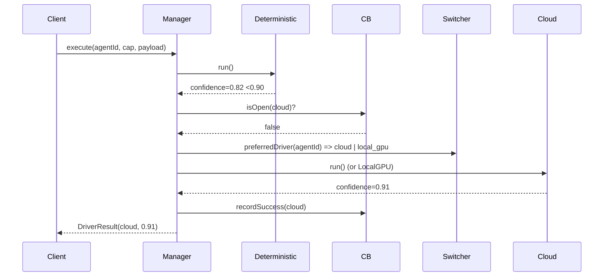

# PHASE 2.3d — Tri-Hybrid Strategy Manager & Fallback Engine (Arena Canonical)

> **Env:** `Arena` (`arena/01a09d54-drfifty`) | **Stack:** Laravel 12 PHP 8.4 | **Pattern:** Adapter + Strategy + Circuit Breaker | **Pillars:** 1 Deterministic-First + 2/3 Tri-Hybrid + 7 Calibrator | **Date:** 2026-09-14

## 0) Executive Summary

`AgentStrategyManager` هو **محول ثلاثي هجين** يحقق `Pillar 1: Deterministic-First` بـ `0 token cost` افتراضيًا، ويتحول تلقائيًا إلى `CloudLlmDriver` أو `LocalGpuDriver ({LOCAL_GPU_ENDPOINT})` فقط عند `confidence <0.90` أو `Regex Mismatch` أو `Exception` غير معالجة — مع `Circuit Breaker` لمنع نزيف الميزانية، و `DynamicStrategySwitcher` يقرأ `micro_switch_matrix` بدون `restart`، وربط `MasterWorkforceFactoryAgent` + `CalibratorSelfHealingEngine`.

```
Request → AgentStrategyManager.execute(agentId, capability, payload)
  → DeterministicRuleDriver.run() → confidence ≥0.90 ? return
  → FallbackEngine (CircuitBreaker HALF-OPEN?) → CloudLlmDriver | LocalGpuDriver → confidence ≥0.90 ? return
  → CalibratorSelfHealingEngine.evaluate() → reroute/price-adjust | HITL
```

### 0.1 AU BUSINESS — Master Core B2B Anchor (AUDIT FIX 2026-09-14 — Phase1→2 Strict Alignment)

**AU BUSINESS (`ab_`, `AU_BUSINESS`) is the Master Core B2B Platform — non-hibernatable (`is_core=1`, `CheckModuleStatus` → `503` blocked), owns **Paymob sub-merchant vault**, **single `app_wallet` universal ledger (no base, `BIGINT subunit`, `CHECK>=0`)**, **FX `exchangerate_api` */30**, and **shared RBAC + AU Lite gateway**. The 4 B2C spokes — **AU MED (`amed_`)**, **AU DEALS (`adl_`)**, **AU SERV (`asv_`)**, **AU INVEST (`ainv_`)** — are `is_core=0` hibernatable and **settle exclusively through AU BUSINESS vault** (no spoke-local liquidity). All tables/APIs below enforce `app_id ENUM('AU_BUSINESS',...) DEFAULT 'AU_BUSINESS'` as root tenure.

**Hub-and-Spoke:**
```
[AU BUSINESS Core `ab_` — B2B Escrow Vault + Wallet + RBAC + Calibrator — Modules 1-9 anchor]
      ├─ AU MED (clinical PG + pgvector)
      ├─ AU DEALS (B2B medicine exchange — Module 4)
      ├─ AU SERV (real-time dispatch — Module 5/6)
      └─ AU INVEST (micro-finance)
```
**Strict Sequential:** `5 Applications` (1 core + 4 spokes) | `9 Modules 1→9` (no 10-15) | `13 Agents 1→13` (`micro_switch_matrix` + `preferred_driver`) | `100% Anti-Leak` (`RegexDataLeakDetector` until `post-escrow holding`) | `Universal Wallet` (`single app_wallet`, `5% adjustable` `commission_rules`, `single-payer Oil3`) | `Calibrator 100→90%` (`Pre<15ms/In/Post` + `Ephemeral Swarm`).

---

---

## 1) Tri-Hybrid Driver Architecture

### 1.1 Contract — `DriverInterface`

```php
// app/Services/Agents/Contracts/DriverInterface.php — PHP 8.4 strict
declare(strict_types=1);
namespace App\Services\Agents\Contracts;

enum DriverType: string { case DETERMINISTIC='deterministic'; case CLOUD='cloud'; case LOCAL_GPU='local_gpu'; }
enum FallbackReason: string { case LOW_CONFIDENCE='low_confidence'; case REGEX_MISMATCH='regex_mismatch'; case EXCEPTION='exception'; case CIRCUIT_OPEN='circuit_open'; }

final readonly class DriverResult {
  public function __construct(
    public DriverType $driver,
    public float $confidence,          // 0.0-1.0
    public array $data,
    public bool $requiresHitl=false,
    public ?FallbackReason $fallbackReason=null,
    public int $tookMs=0,
  ) {}
  public function isConfident(): bool { return $this->confidence >= 0.90; }
}

interface DriverInterface {
  public function run(string $capability, array $payload): DriverResult;
  public function name(): DriverType;
  public function supports(string $capability): bool;
}
```

### 1.2 Driver 1 — `DeterministicRuleDriver` (100% Free, 0 tokens)

Pure PHP 8.4 + Regex + State Machines + Rule Engines — يُستدعى أولًا دائمًا.

```php
// app/Services/Agents/Drivers/DeterministicRuleDriver.php
namespace App\Services\Agents\Drivers;
use App\Services\Agents\Contracts\{DriverInterface, DriverType, DriverResult};
use App\Services\Rules\DeterministicRuleEngineInterface;
use App\Services\Security\RegexDataLeakDetector;

final class DeterministicRuleDriver implements DriverInterface {
  public function __construct(
    private DeterministicRuleEngineInterface $rules, // Pricing/Ranking/Barter
    private RegexDataLeakDetector $leak,
  ) {}
  public function name(): DriverType { return DriverType::DETERMINISTIC; }
  public function supports(string $c): bool { return true; } // always
  public function run(string $capability, array $payload): DriverResult {
    $t=microtime(true);
    try {
      $r=$this->rules->evaluate(['capability'=>$capability,'payload'=>$payload]);
      // Regex gate — if leaks blocked, confidence degrades
      $leak=$this->leak->sanitize(json_encode($r->output), 'pre_llm');
      if($leak->blocked) return new DriverResult(DriverType::DETERMINISTIC, 0.4, $r->output, true, FallbackReason::REGEX_MISMATCH, (int)((microtime(true)-$t)*1000));
      return new DriverResult(DriverType::DETERMINISTIC, $r->confidence, $r->output, $r->requiresHitl, tookMs:(int)((microtime(true)-$t)*1000));
    } catch(\Throwable $e) {
      return new DriverResult(DriverType::DETERMINISTIC, 0.0, ['error'=>$e->getMessage()], true, FallbackReason::EXCEPTION, (int)((microtime(true)-$t)*1000));
    }
  }
}
```

**Engines inside:** `PricingRuleEngine` (5% 3-Tier), `RankingRuleEngine` (8-point), `BarterSplitEngine` (1.5x), `EligibilityStateMachine`, `DispatchRadiusOptimizer` — all deterministic.

### 1.3 Driver 2 — `CloudLlmDriver` (External APIs)

```php
// app/Services/Agents/Drivers/CloudLlmDriver.php
namespace App\Services\Agents\Drivers;
use App\Services\Agents\Contracts\{DriverInterface, DriverType, DriverResult, FallbackReason};
use Illuminate\Support\Facades\Http;

final class CloudLlmDriver implements DriverInterface {
  public function __construct(private string $apiKey, private string $model='gpt-4o-mini') {}
  public function name(): DriverType { return DriverType::CLOUD; }
  public function supports(string $c): bool { return in_array($c, ['negotiate','summarize','classify','generate']); }
  public function run(string $capability, array $payload): DriverResult {
    $t=microtime(true);
    $res=Http::timeout(12)->withToken($this->apiKey)->post('https://api.openai.com/v1/chat/completions', [
      'model'=>$this->model, 'temperature'=>0.2,
      'messages'=>[['role'=>'system','content'=>$payload['systemPrompt']??'You are AU Agent.'],'content'=>json_encode($payload)],
    ]);
    if($res->failed()) return new DriverResult(DriverType::CLOUD, 0.0, ['error'=>$res->body()], true, FallbackReason::EXCEPTION, (int)((microtime(true)-$t)*1000));
    $data=$res->json('choices.0.message.content'); $conf=(float)($res->json('usage.confidence')??0.88);
    return new DriverResult(DriverType::CLOUD, $conf, ['output'=>$data], $conf<0.90, tookMs:(int)((microtime(true)-$t)*1000));
  }
}
```

### 1.4 Driver 3 — `LocalGpuDriver` (vLLM via `{LOCAL_GPU_ENDPOINT}`)

```php
// app/Services/Agents/Drivers/LocalGpuDriver.php
namespace App\Services\Agents\Drivers;
use App\Services\Agents\Contracts\{DriverInterface, DriverType, DriverResult, FallbackReason};
use Illuminate\Support\Facades\Http;

final class LocalGpuDriver implements DriverInterface {
  public function __construct(private string $endpoint) {} // env LOCAL_GPU_ENDPOINT=http://vllm_gpu:8000/v1
  public function name(): DriverType { return DriverType::LOCAL_GPU; }
  public function supports(string $c): bool { return true; }
  public function run(string $capability, array $payload): DriverResult {
    $t=microtime(true);
    $res=Http::timeout(20)->post(rtrim($this->endpoint,'/').'/chat/completions', [
      'model'=>'mistralai/Mistral-7B-Instruct-v0.2','temperature'=>0.3,
      'messages'=>[['role'=>'system','content'=>$payload['systemPrompt']??''],'content'=>json_encode($payload)],
    ]);
    if($res->failed()) return new DriverResult(DriverType::LOCAL_GPU, 0.0, ['error'=>$res->body()], true, FallbackReason::EXCEPTION, (int)((microtime(true)-$t)*1000));
    $data=$res->json('choices.0.message.content'); $conf=(float)($res->json('confidence')??0.86);
    return new DriverResult(DriverType::LOCAL_GPU, $conf, ['output'=>$data], $conf<0.90, tookMs:(int)((microtime(true)-$t)*1000));
  }
}
```

---

## 2) Automatic Graceful Fallback Engine + Circuit Breaker

### 2.1 Fallback Triggers (OR)

- `confidence < 0.90` (Pillar 2)
- `Regex Mismatch` (`LeakResult.blocked`)
- `Unhandled Exception` (edge-case)
- `Circuit OPEN` → skip LLM, go HITL directly.

### 2.2 Circuit Breaker (Redis — prevents budget overrun)

```php
// app/Services/Agents/CircuitBreaker.php
namespace App\Services\Agents;
use Illuminate\Support\Facades\Redis;

final class CircuitBreaker {
  public function __construct(private int $threshold=5, private int $cooldownSec=300) {} // 5 consecutive fails → open 5min
  private function key(string $driver): string { return "cb:{$driver}"; }
  public function isOpen(string $driver): bool {
    $s=Redis::get($this->key($driver)); if(!$s) return false;
    ['failures'=>$f,'opened_at'=>$o]=json_decode($s,true);
    if($f < $this->threshold) return false;
    if(time()-$o > $this->cooldownSec){ $this->halfOpen($driver); return false; }
    return true;
  }
  public function recordSuccess(string $driver): void { Redis::del($this->key($driver)); }
  public function recordFailure(string $driver): void {
    $k=$this->key($driver); $raw=Redis::get($k); $d=$raw?json_decode($raw,true):['failures'=>0,'opened_at'=>null];
    $d['failures']++; if($d['failures']>=$this->threshold) $d['opened_at']=time();
    Redis::setex($k, 3600, json_encode($d));
  }
  public function halfOpen(string $d): void { Redis::setex($this->key($d), 60, json_encode(['failures'=>$this->threshold-1,'opened_at'=>time()-$this->cooldownSec+30])); }
  public function remainingBudget(string $driver): int { return max(0, $this->threshold - (json_decode(Redis::get($this->key($driver))?:'{"failures":0}',true)['failures'])); }
}
```

*Budget guard:* `max 5 consecutive LLM fallbacks / 5 min per driver` → `Max ~ 60 LLM calls / hour` — zero runaway. Metrics via `Calibrator` + `Reverb`.

### 2.3 Fallback Engine Sequence



---

## 3) Dynamic Strategy Switcher (DB-driven, No Restart)

Runtime control via `micro_switch_matrix` + `feature_flags` — cached in Redis, invalidated via `Reverb` + `Cache::tags`.

```php
// app/Services/Agents/DynamicStrategySwitcher.php
namespace App\Services\Agents;
use App\Services\Agents\Contracts\DriverType;
use Illuminate\Support\Facades\{Cache, Redis};

final readonly class StrategyConfig {
  public function __construct(public DriverType $preferred, public bool $llmEnabled, public bool $requiresHitl, public int $ttlSec=30){}
}
final class DynamicStrategySwitcher {
  public function config(int $agentId): StrategyConfig {
    $key="strategy:{$agentId}";
    return Cache::remember($key, 30, function() use($agentId){
      $row=\DB::table('micro_switch_matrix')->where('agent_id',$agentId)->where('is_enabled',1)->first();
      if(!$row) return new StrategyConfig(DriverType::DETERMINISTIC, false, true);
      // feature_flags AU Lite override
      $flag=Cache::get('feature_flags:au_lite'); // broadcast via private-calibrator
      if($flag==='enabled' && $row->is_core) $row->preferred_driver='deterministic';
      return new StrategyConfig(
        DriverType::from($row->preferred_driver ?? 'deterministic'),
        (bool)$row->llm_fallback_enabled,
        (bool)$row->requires_hitl,
      );
    });
  }
  public function invalidate(int $agentId): void { Cache::forget("strategy:{$agentId}"); Redis::publish('strategy:invalidate', (string)$agentId); }
}
```

*Binding:* `POST /api/v1/governance/micro-switches/toggle` (2.2e) → `Switcher.invalidate()` + `Reverb private-calibrator` → next `execute()` picks new driver without restart.

`app/Services/Agents/AgentStrategyManager` also exposes `switchDriver(int $agentId, DriverType $driver): void` for HQ `MicroSwitchMatrixPanel`.

---

## 4) Workforce Factory & Calibrator Strategy Binding

### 4.1 `MasterWorkforceFactoryAgent` Trigger (Agent 12 — inside Manager)

Auto-configures `memory bounds` + `system prompt persona` on `ProvisionDigitalAgentAction`.

```php
// app/Services/Agents/MasterWorkforceFactory.php
namespace App\Services\Agents;
final class MasterWorkforceFactory {
  public function configure(int $agentId, string $capability, array $payload): array {
    $agent=\DB::table('agents')->find($agentId);
    $mem=$this->memoryBounds($agent->tier); // e.g., CFO 512MB, DevOps 1GB
    $persona=$this->persona($agent->slug, $capability); // systemPrompt per 13 agents registry
    // Write to tenant_agents.meta + calibrate
    return ['memoryMb'=>$mem, 'systemPrompt'=>$persona, 'maxTokens'=>$this->maxTokens($agent->tier)];
  }
  private function memoryBounds(string $tier): int { return match($tier){'premium'=>1024,'standard'=>512,default=>256};}
  private function persona(string $slug, string $cap): string { return "You are {$slug} — capability {$cap} — AU Platform deterministic-first..."; }
  private function maxTokens(string $t): int { return $t==='premium'? 2048: 1024; }
}
```

*Hook:* `AgentStrategyManager` calls `MasterWorkforceFactory::configure()` before `Driver::run()` → injects `payload['systemPrompt']` + `memoryMb` into `Drivers`.

### 4.2 `CalibratorSelfHealingEngine` Binding

Evaluates every `DriverResult.confidence` post-execution; on `gate failure` (<0.90 even after LLM) → deterministic `price adjustment` or `workflow rerouting`.

```php
// app/Services/Calibrator/CalibratorSelfHealingEngine.php
namespace App\Services\Calibrator;
use App\Services\Agents\Contracts\DriverResult;

final class CalibratorSelfHealingEngine {
  public function evaluate(DriverResult $r, string $context): HealDecision {
    if($r->isConfident()) return new HealDecision(false, null);
    // Gate failure path
    return match($context){
      'pricing' => new HealDecision(true, ['action'=>'price_adjust','delta'=>-0.02,'reason'=>$r->fallbackReason]), // -2% auto
      'dispatch' => new HealDecision(true, ['action'=>'reroute','nextRegion'=>'Cairo-East','reason'=>$r->fallbackReason]),
      default => new HealDecision(true, ['action'=>'hitl','queue'=>$context]),
    };
  }
}
final readonly class HealDecision { public function __construct(public bool $shouldHeal, public ?array $patch){} }
```

*Integration:* `AgentStrategyManager.execute()` → `CalibratorSelfHealingEngine::evaluate(result, capability)` → if `shouldHeal`, applies `DeterministicRuleEngine` patch (price/reroute) and logs to `agent_actions` + Reverb `private-calibrator`.

---

## 5) Complete `AgentStrategyManager` Skeleton (Orchestrator)

```php
// app/Services/Agents/AgentStrategyManager.php — PHP 8.4 ultra-concise
declare(strict_types=1);
namespace App\Services\Agents;

use App\Services\Agents\Contracts\{DriverInterface, DriverResult, DriverType, FallbackReason};
use App\Services\Agents\Drivers\{DeterministicRuleDriver, CloudLlmDriver, LocalGpuDriver};
use App\Services\Calibrator\CalibratorSelfHealingEngine;
use Illuminate\Support\Facades\Log;

final class AgentStrategyManager {
  public function __construct(
    private DeterministicRuleDriver $deterministic,
    private CloudLlmDriver $cloud,
    private LocalGpuDriver $localGpu,
    private DynamicStrategySwitcher $switcher,
    private CircuitBreaker $breaker,
    private MasterWorkforceFactory $factory,
    private CalibratorSelfHealingEngine $calibrator,
  ) {}

  public function execute(int $agentId, string $capability, array $payload): DriverResult {
    // 1. Dynamic config (DB without restart)
    $cfg=$this->switcher->config($agentId);
    // 2. Factory persona injection
    $factoryCtx=$this->factory->configure($agentId, $capability, $payload);
    $payload=array_merge($payload, $factoryCtx);

    // 3. Deterministic first (0 cost)
    $det=$this->deterministic->run($capability, $payload);
    if($det->isConfident() && !$det->requiresHitl) {
      $this->breaker->recordSuccess(DriverType::DETERMINISTIC->value);
      $this->postCalibrate($det, $capability);
      return $det;
    }
    // HITL short-circuit if llm disabled
    if(!$cfg->llmEnabled) { $this->postCalibrate($det, $capability); return $det; }

    // 4. Fallback — pick driver per switcher + circuit
    $reason=$det->fallbackReason ?? FallbackReason::LOW_CONFIDENCE;
    $preferred=$cfg->preferred === DriverType::DETERMINISTIC ? DriverType::CLOUD : $cfg->preferred;
    $target=$this->breaker->isOpen($preferred->value) ? ($preferred===DriverType::CLOUD? DriverType::LOCAL_GPU: DriverType::CLOUD) : $preferred;
    if($this->breaker->isOpen($target->value)) { // both open → HITL
      Log::warning('both_llm_circuits_open', ['agentId'=>$agentId, 'reason'=>$reason->value]);
      $this->postCalibrate($det, $capability); return $det;
    }

    $driver=$this->driverFor($target);
    if(!$driver->supports($capability)) $driver=$this->cloud; // fallback
    $llm=$driver->run($capability, $payload);
    $llm->isConfident() ? $this->breaker->recordSuccess($target->value) : $this->breaker->recordFailure($target->value);
    $this->postCalibrate($llm->isConfident()? $llm: $det, $capability);
    return $llm->isConfident() ? $llm : $det; // graceful: return best available
  }

  private function driverFor(DriverType $t): DriverInterface { return match($t){
    DriverType::DETERMINISTIC=> $this->deterministic, DriverType::CLOUD=> $this->cloud, DriverType::LOCAL_GPU=> $this->localGpu,
  };}
  private function postCalibrate(DriverResult $r, string $cap): void {
    $heal=$this->calibrator->evaluate($r, $cap);
    if($heal->shouldHeal) Log::info('calibrator_heal', ['patch'=>$heal->patch]);
  }
  public function switchDriver(int $agentId, DriverType $driver): void { \DB::table('micro_switch_matrix')->where('agent_id',$agentId)->update(['preferred_driver'=>$driver->value]); $this->switcher->invalidate($agentId); }
}
```

**Container wiring** `app/Providers/AppServiceProvider.php`:

```php
$this->app->singleton(DeterministicRuleDriver::class, fn()=> new DeterministicRuleDriver(app(DeterministicRuleEngineInterface::class), app(RegexDataLeakDetector::class)));
$this->app->singleton(CloudLlmDriver::class, fn()=> new CloudLlmDriver(config('services.openai.key')));
$this->app->singleton(LocalGpuDriver::class, fn()=> new LocalGpuDriver(config('services.vllm.endpoint'))); // env LOCAL_GPU_ENDPOINT
$this->app->singleton(AgentStrategyManager::class);
```

---

## 6) Runtime Control — HQ Integration

- `MicroSwitchMatrixPanel` (2.3b) → `POST /governance/micro-switches/toggle {agent_id, preferred_driver, llm_fallback_enabled}` → `AgentStrategyManager::switchDriver()` + `Switcher::invalidate()` → `Reverb private-calibrator` push → `PerformanceGauge` updates live.
- `Kill-switch` `POST /governance/kill-switch` → `Switcher.invalidate` all + `CircuitBreaker` open all → deterministic fallback globally.
- `HitlInbox` receives `requiresHitl=true` → `POST /governance/hitl/approve`.

---

## 7) Compliance

| Rule | Cover |
|------|-------|
| Pillar 1 Deterministic-First | `DeterministicRuleDriver` always first, 0 tokens |
| Pillar 2/3 Tri-Hybrid | 3 drivers + adapter + graceful fallback |
| Circuit Breaker | Redis `5/5min` budget guard |
| Dynamic Strategy | `micro_switch_matrix` cached 30s, no restart |
| Factory + Calibrator | persona + memory + heal reroute/price |

---

**ملخص عربي:** محول استراتيجيات ثلاثي — حتمي مجاني أولًا → تبديل تلقائي سحابي/محلي عند ثقة <90% مع قاطع دارة وتبديل ديناميكي من الداتابيز بدون إعادة تشغيل، مربوط بمصنع القوى العاملة والمعاير للإصلاح الذاتي.

*Next: [PROMPT 2.4] Master Admin HQ*
