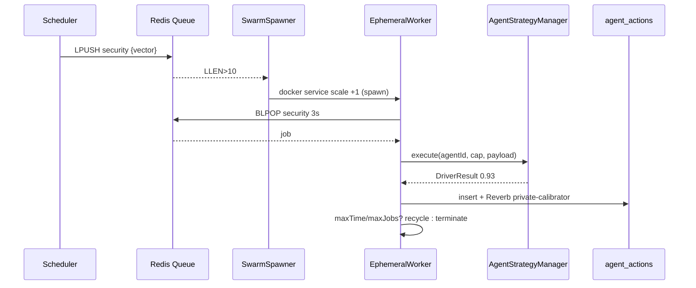
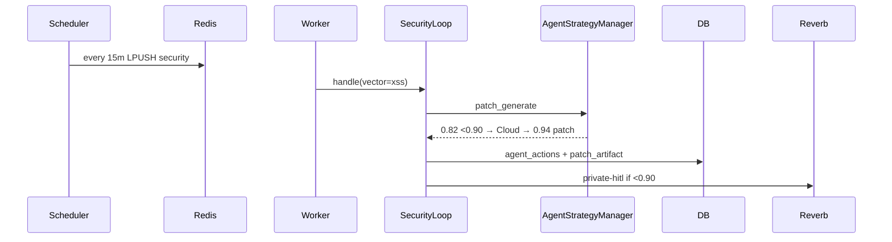
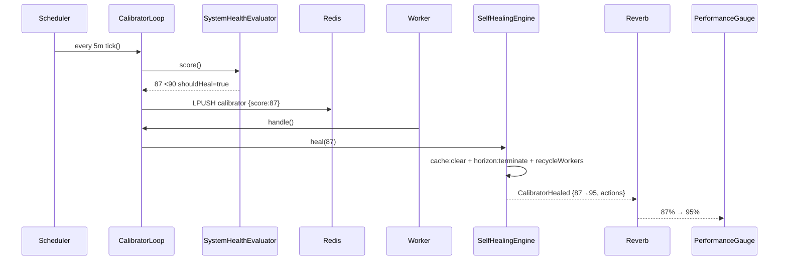

# PHASE 2.3e — Ephemeral Swarms & Proactive Healing Engine (Arena Canonical)

> **Env:** `Arena` (`arena/01a09d54-drfifty`) | **Stack:** Laravel 12 PHP 8.4 + Redis + Docker Swarm (prod) | **Pillons:** 7 Calibrator → 8 Ephemeral Swarm + 2/3 Tri-Hybrid | **Reverb:** 8080 | **Date:** 2026-09-14

## 0) Executive — Ephemeral = Serverless inside Swarm

كل `job` هو `container` مؤقت **ينشأ عند حدث Redis** ويُنهي نفسه بعد `3600s` أو `1000 job` — لا workers دائمة. `3 حلقات استباقية` تعمل `24/7` عبر نفس المحرك، و `Calibrator Loop` يراقب `health 100→90%` ويُصلّح تلقائيًا (`cache:clear`, `queue:restart`, `container recycle`) عند `<90%`.

```
Event → Redis Queue (security|legal|refactor|calibrator) → SwarmSpawner → docker service scale +1 → EphemeralWorker (pull → AgentStrategyManager → report → self-terminate) → Reverb private-calibrator
```

---

## 1) Swarm Execution Specification

### 1.1 Redis Queue Triggers (Laravel `queue:work redis` — Pillar 6)

| Queue | Trigger | Payload | TTL |
|-------|---------|---------|-----|
| `security` | `cron */15 + onDeploy + webhook` | `{target, vector}` | 15m |
| `legal` | `cron hourly + contract publish` | `{contract_uuid, regulation}` | 1h |
| `refactor` | `cron */30 + slow_query>500ms` | `{query_hash, table}` | 30m |
| `calibrator` | `health <90 OR cron */5` | `{score, components}` | 5m |
| `workforce` | `POST /workforce/dispatch` | `{tenant_agent_id, task}` | 10m |
| `default` | `any user job` | — | — |

**Connection `config/queue.php`:** `redis: {connection: default, queue: default, retry_after: 90, block_for_null: true}`

**Horizon `config/horizon.php` (autoscale):**

```php
'environments' => ['production' => [
  'supervisor-1' => ['connection'=>'redis','queue'=>['security','legal','refactor','calibrator','workforce'],'balance'=>'auto','minProcesses'=>1,'maxProcesses'=>10,'balanceMaxShift'=>2,'balanceCooldown'=>3,'tries'=>3,'timeout'=>90,'maxTime'=>3600,'maxJobs'=>1000],
]]
```

*`balance:auto`* يقرأ `queue length` من Redis `LLEN` كل `3s` → `scale up/down` بـ `+1/-1`.

### 1.2 Docker Swarm Ephemeral Spec (prod — `docker-compose.prod.yml` §worker)

```yaml
  worker:
    image: abduniproject/app:prod
    command: php artisan queue:work redis --sleep=3 --tries=3 --max-time=3600 --max-jobs=1000
    # --max-time 3600 → self-terminate after 1h (ephemeral)
    # --max-jobs 1000 → recycle after 1k jobs (prevent memory leak)
    deploy: { replicas: 3, restart_policy: {condition: on-failure}, resources: {limits: {cpus: '1', memory: 1G}}}
    networks: [backend]
  agent_sandboxes:
    image: abduniproject/sandbox:php84
    deploy: {replicas: 0} # 0 → spawned on-demand via SwarmSpawner, read_only + no-new-privileges
    read_only: true; tmpfs: [/tmp]; security_opt: [no-new-privileges:true]; cap_drop: [ALL]
```

**Autoscaler (lightweight `SwarmSpawner` PHP):** listens `Redis::blpop` — if `LLEN > 10` → `docker service scale abduniproject_worker=5` via Docker API `POST /services/{id}/update`.

### 1.3 Worker Lifecycle Contract (PHP 8.4)

```php
// app/Services/Swarm/Contracts/WorkerLifecycleInterface.php
declare(strict_types=1);
namespace App\Services\Swarm\Contracts;
enum WorkerState: string { case SPAWNING='spawning'; case PULLING='pulling'; case EXECUTING='executing'; case REPORTING='reporting'; case TERMINATING='terminating'; case RECYCLED='recycled'; }
final readonly class WorkerContext { public function __construct(public string $workerId, public string $queue, public array $job, public float $startedAt){} }
interface WorkerLifecycleInterface {
  public function spawn(WorkerContext $ctx): string; // docker run → containerId
  public function pull(string $workerId): ?array; // BLPOP redis
  public function execute(array $job): ExecutionResult;
  public function report(ExecutionResult $r): void; // agent_actions + Reverb
  public function terminate(string $workerId, string $reason): void; // exit 0
  public function recycleIfNeeded(string $workerId): bool; // maxTime/maxJobs → true
}
final readonly class ExecutionResult { public function __construct(public bool $ok, public float $confidence, public array $artifact, public int $tookMs){} }

// app/Services/Swarm/EphemeralWorker.php
final class EphemeralWorker implements WorkerLifecycleInterface {
  public function __construct(private \App\Services\Agents\AgentStrategyManager $manager, private \App\Services\Calibrator\SelfHealingEngine $healer){}
  public function execute(array $job): ExecutionResult {
    $t=microtime(true);
    $r=$this->manager->execute($job['agent_id'], $job['capability'], $job['payload']);
    $this->report(new ExecutionResult($r->isConfident(), $r->confidence, $r->data, (int)((microtime(true)-$t)*1000)));
    return new ExecutionResult($r->isConfident(), $r->confidence, $r->data, (int)((microtime(true)-$t)*1000));
  }
  public function report(ExecutionResult $r): void {
    \DB::table('agent_actions')->insert(['result'=>json_encode($r->artifact),'confidence'=>$r->confidence,'took_ms'=>$r->tookMs]);
    event(new \App\Events\CalibratorTick($r)); // → private-calibrator Reverb
  }
  public function recycleIfNeeded(string $wid): bool { return (microtime(true)-$this->start) > 3600 || $this->jobs >= 1000; }
  // spawn/pull/terminate via Redis + Docker API
}
```

**Lifecycle:** `SPAWNING (docker create)` → `PULLING (BLPOP 3s)` → `EXECUTING (AgentStrategyManager <90% fallback)` → `REPORTING (agent_actions + Reverb)` → `TERMINATING (exit 0)` → `RECYCLED` if needed.



---

## 2) Continuous Proactive Loops (Pillar 7 + 11)

### 2.1 Security Agent Loop (Agent 6 SecOps) — Pen-Test & Patch

```php
// app/Services/Proactive/SecurityLoop.php
final class SecurityLoop implements ProactiveLoopInterface {
  public int $intervalSec=900; public string $queue='security';
  public function tick(): void {
    $vectors=['sqli','xss','idor','rate_limit','leak']; // OWASP
    foreach($vectors as $v){ \Queue::push(new SimulateAttackJob($v), $this->queue); }
  }
  public function handle(array $payload): ExecutionResult {
    // 1. simulate (deterministic scanner + regex)
    $found=$this->scan($payload['vector']); // e.g., nikto-like
    // 2. patch generation (DeterministicRuleDriver first, fallback <0.90 → LocalGpu)
    $patch=$this->manager->execute(6, 'patch_generate', ['vector'=>$payload['vector'],'found'=>$found]);
    // 3. HITL if confidence<0.90 → private-hitl
    if(!$patch->isConfident()) \Event::dispatch(new HitlRequired(6, $patch));
    return new ExecutionResult($patch->isConfident(), $patch->confidence, $patch->data, 0);
  }
}
```



### 2.2 Legal Agent Loop (Agent 7 CLO) — Breach Simulation & Hardening

```php
final class LegalLoop implements ProactiveLoopInterface {
  public int $intervalSec=3600; public string $queue='legal';
  public function tick(): void { \Queue::push(new RegulatoryBreachJob(['regulation'=>'EG-CPA','clauses'=>['refund','escrow']]), 'legal'); }
  public function handle(array $p): ExecutionResult {
    $breach=$this->simulateBreach($p['regulation']); // e.g., missing refund clause
    $hardened=$this->manager->execute(7, 'contract_harden', ['breach'=>$breach,'clauses'=>$p['clauses']]);
    if($hardened->isConfident()) \DB::table('contracts')->where('uuid',$p['contract_uuid'])->update(['hardened'=>json_encode($hardened->data)]);
    return new ExecutionResult($hardened->isConfident(), $hardened->confidence, $hardened->data, 0);
  }
}
```

### 2.3 Refactoring Agent Loop (Agent 11 DevOps) — Slow Query → Optimization Proposal

```php
final class RefactoringLoop implements ProactiveLoopInterface {
  public int $intervalSec=1800; public string $queue='refactor';
  public function tick(): void {
    $slow=\DB::select("SELECT query, mean_exec_time FROM pg_stat_statements WHERE mean_exec_time>500 ORDER BY mean_exec_time DESC LIMIT 5"); // or MySQL slow_log
    foreach($slow as $q) \Queue::push(new OptimizeQueryJob((array)$q), 'refactor');
  }
  public function handle(array $p): ExecutionResult {
    $proposal=$this->manager->execute(11, 'query_optimize', ['query'=>$p['query'],'table'=>$p['table']]);
    // Deterministic first: EXPLAIN + index suggestion; fallback → LocalGpu for rewrite
    if($proposal->isConfident()) \Event::dispatch(new OptimizationProposed($proposal->data));
    return new ExecutionResult($proposal->isConfident(), $proposal->confidence, $proposal->data, 0);
  }
}
interface ProactiveLoopInterface { public function tick(): void; public function handle(array $payload): ExecutionResult; }
```

Each loop dispatched via `app/Console/Kernel.php`:

```php
$schedule->call(fn()=> app(SecurityLoop::class)->tick())->everyFifteenMinutes()->onOneServer();
$schedule->call(fn()=> app(LegalLoop::class)->tick())->hourly()->onOneServer();
$schedule->call(fn()=> app(RefactoringLoop::class)->tick())->everyThirtyMinutes()->onOneServer();
$schedule->call(fn()=> app(CalibratorLoop::class)->tick())->everyFiveMinutes()->onOneServer();
```

---

## 3) Calibrator Self-Healing Loop (Health 100→90%)

### 3.1 Health Score (Pillar 7)

```php
// app/Services/Calibrator/SystemHealthEvaluator.php
final readonly class HealthScore { public function __construct(public float $score, public array $components, public bool $shouldHeal){} }
final class SystemHealthEvaluator {
  public function score(): HealthScore {
    $c=[
      'queue_latency' => $this->queueLatency(), // Redis LLEN + horizon lag
      'error_rate'    => $this->errorRate(),    // 5xx / total
      'worker_health' => $this->workerHealth(), // failed jobs / total
      'db_slow'       => $this->dbSlow(),       // slow queries %
      'leak_blocked'  => $this->leakRate(),
      'uptime'        => $this->uptime(),
    ];
    $score=100 - array_sum(array_map(fn($v)=> max(0, ($v['value']-$v['threshold'])*$v['weight']), $c));
    return new HealthScore(max(90, min(100, $score)), $c, $score < 90);
  }
}
```

Broadcast: `event(new HealthScoreUpdated($score)) → private-calibrator` → `PerformanceGauge 100→90%`.

### 3.2 SelfHealingEngine — Auto Recycle + Cache Flush

```php
// app/Services/Calibrator/SelfHealingEngine.php
final class SelfHealingEngine {
  public function heal(HealthScore $s): HealResult {
    if(!$s->shouldHeal) return new HealResult(false, []);
    $actions=[];
    // 1. Cache flush (Redis + route/config)
    \Artisan::call('cache:clear'); \Artisan::call('config:clear'); $actions[]='cache:clear';
    // 2. Queue restart (Horizon)
    \Artisan::call('horizon:terminate'); $actions[]='horizon:terminate';
    // 3. Container recycle (Swarm)
    $this->recycleWorkers(); $actions[]='workers:recycled';
    // 4. Route cache rebuild if error_rate high
    if(($s->components['error_rate']['value']??0)>5) { \Artisan::call('route:cache'); $actions[]='route:cache'; }
    \Log::info('calibrator_heal', ['score'=>$s->score,'actions'=>$actions]);
    event(new CalibratorHealed($s, $actions)); // → private-calibrator + private-hitl if manual
    return new HealResult(true, $actions);
  }
  private function recycleWorkers(): void {
    // docker service update --force abduniproject_worker (rolling)
    \Http::post('http://docker-socket/services/abduniproject_worker/update', ['force_update'=>1]);
  }
}
final readonly class HealResult { public function __construct(public bool $healed, public array $actions){} }

// app/Services/Proactive/CalibratorLoop.php
final class CalibratorLoop implements ProactiveLoopInterface {
  public int $intervalSec=300; public string $queue='calibrator';
  public function __construct(private SystemHealthEvaluator $eval, private SelfHealingEngine $healer){}
  public function tick(): void { $score=$this->eval->score(); if($score->shouldHeal) \Queue::push(new HealJob($score), $this->queue); }
  public function handle(array $p): ExecutionResult { $s=$this->eval->score(); $r=$this->healer->heal($s); return new ExecutionResult($r->healed, $r->healed?0.95:0.5, $r->actions, 0); }
}
```



---

## 4) Worker Lifecycle Contracts Summary

| State | Trigger | Action | Timeout |
|-------|---------|--------|---------|
| SPAWNING | `LLEN>10` or `cron` | `docker service scale +1` | 5s |
| PULLING | `BLPOP queue 3s` | `null → sleep 3s → retry` | 3s |
| EXECUTING | job pulled | `AgentStrategyManager.execute()` + `CircuitBreaker` | 90s |
| REPORTING | done | `agent_actions insert + Reverb` | 2s |
| TERMINATING | `ok` | `exit 0` | — |
| RECYCLED | `uptime>3600 OR jobs>=1000` | `docker rm + spawn new` | — |

**Isolation:** `backend` network only, `read_only + no-new-privileges + cap_drop ALL`, `tmpfs /tmp`, `security_opt`.

**Observability:** `agent_actions` ledger (append-only, `confidence`, `took_ms`) + `private-calibrator` + `private-hitl` + `Horizon metrics`.

---

**ملخص عربي:** أسراب مؤقتة تُنشأ عند حدث Redis وتنهي نفسها بعد ساعة/1000 مهمة — مع 3 حلقات استباقية (أمان/قانوني/إعادة هيكلة) وحلقة معاير تُصلّح تلقائيًا عند <90% عبر تفريغ كاش وإعادة تشغيل الطوابير وتدوير الحاويات.

*Next: [PROMPT 2.4] Master Admin HQ*
